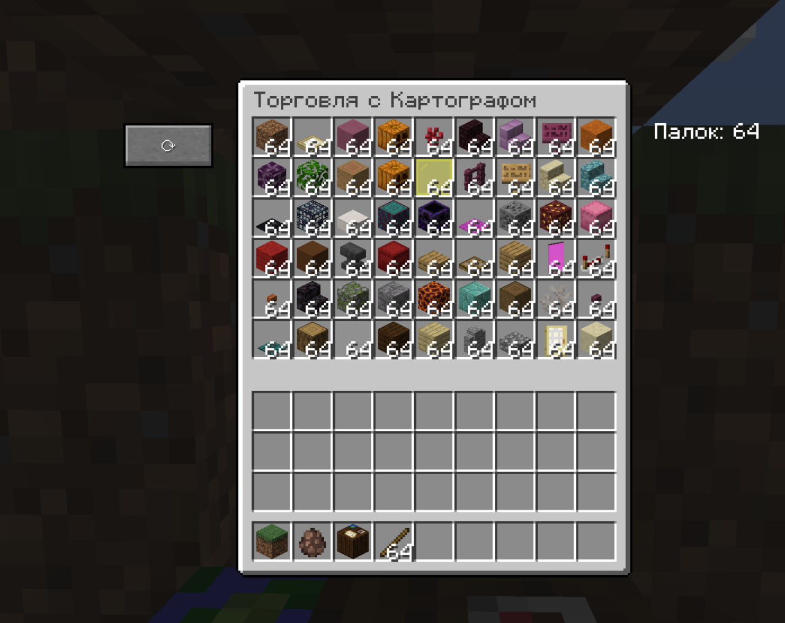

# 🧱 Cheap Blocks Trader (Minecraft Mod)

[](https://www.minecraft.net/)
[](https://files.minecraftforge.net/)
[](LICENSE)

**Торгуйте с картографом и получайте любые блоки стаками всего за 1 палку!**


---

## 📖 Описание

Этот мод полностью заменяет стандартный интерфейс торговли с картографом на удобное меню в стиле двойного сундука (54 слота).  
Теперь вам не нужно тратить время на добычу редких ресурсов — **все ванильные блоки доступны по цене 1 палка за стак (64 шт.)**.

Ассортимент сохраняется для каждого картографа индивидуально, а обновить его можно в любой момент нажатием одной кнопки.

---

## ✨ Основные возможности

- 🧩 **54 слота товаров** – как в двойном сундуке, огромный выбор блоков.
- 🔄 **Случайный ассортимент** – при первом открытии или по кнопке «Обновить» генерируются новые блоки.
- 💾 **Сохранение предложений** – каждый картограф «помнит» свои товары между сессиями.
- 💰 **Простая валюта** – всё покупается за **обычные палки** (1 палка = 1 стак).
- 🖼️ **Чистый интерфейс** – кнопка обновления и счётчик палок вынесены за пределы окна, не перекрывая слоты.
- 🌐 **Полная поддержка мультиплеера** – синхронизация работает на серверах.

---

## 📥 Требования

- **Minecraft**: `1.16.5`
- **Forge**: `36.2.42` (или новее в пределах 1.16.5)
- **Java**: `8` (уже включена в Forge)
- **Опционально**: совместим с **OptiFine** (рекомендуется `HD U G7` / `G8`)

---

## 📦 Установка

1. Скачайте последнюю версию мода из [Releases](https://github.com/ВАШ_ЛОГИН/cheap-blocks-trader/releases).
2. Поместите файл `.jar` в папку `mods` вашего клиента или сервера Minecraft.
3. Запустите игру с профилем **Forge 1.16.5**.
4. Найдите в деревне **картографа** (житель с золотым моноклем) и кликните по нему правой кнопкой мыши.

---

## 🎮 Как пользоваться

1. **Откройте интерфейс** картографа – вы увидите сетку 6×9 с различными блоками.
2. **Положите палки в свой инвентарь** (они же будут валютой).
3. **Кликните левой кнопкой мыши** по любому слоту с товаром – одна палка исчезнет, а в инвентарь добавится стак выбранного блока.
4. **Нажмите кнопку «⟳» слева**, чтобы полностью обновить ассортимент случайными блоками.
5. Счётчик оставшихся палок отображается **справа от окна**.

> 💡 **Совет:** Если нужного блока нет – просто нажмите кнопку обновления несколько раз, и он обязательно появится!

---

## 🖼️ Скриншоты

Торговля в процессе 

 

---

## 🔧 Сборка из исходников

Если вы хотите собрать мод самостоятельно:

```bash
git clone https://github.com/ВАШ_ЛОГИН/cheap-blocks-trader.git
cd cheap-blocks-trader
./gradlew build